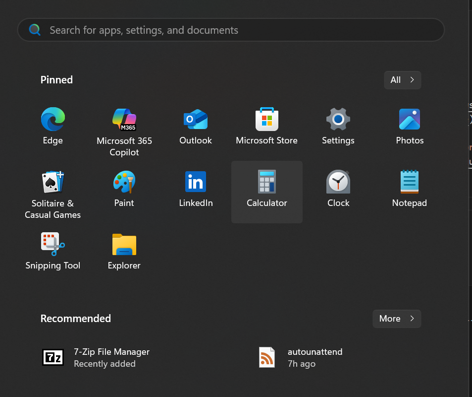

# Config files
Must be placed in `./config`

### [`StartPins.json`](/defaultconfig/StartPins.json)

winndows 11 json for `StartPinSettings`
- [start layout example](https://learn.microsoft.com/en-us/windows/configuration/start/layout?tabs=intune-10%2Cintune-11&pivots=windows-11#start-layout-example)

The current startlayout can be dumped over PowerShell with [`Export-Startlayout -Path ./config/Startpint.json`](https://learn.microsoft.com/en-us/powershell/module/startlayout/export-startlayout)

### [`TaskBarIcons.xml`](/defaultconfig/TaskbarIcons.xml)
Icons to be dispayed on the TaskBar

- [Taskbar Layout example](https://learn.microsoft.com/en-us/windows/configuration/taskbar/pinned-apps?tabs=intune&pivots=windows-11#taskbar-layout)
- [TaskbarLayout Schema Definition](https://learn.microsoft.com/en-us/windows/configuration/taskbar/xsd)

# Scripts

### [`System.ps1`](/defaultconfig/System.ps1)
Script is to run in the system context, before user accounts are created.

### [`FirstLogon.ps1`](/defaultconfig/FirstLogon.ps1)
Script is to run when the first user logs on.

### [`UserOnce.ps1`](/defaultconfig/UserOnce.ps1)
Script is to run whenever a user logs on for the first time.

### [`DefaultUser.ps1`](/defaultconfig/Defaultuser.ps1)
Script is to modify the default user's registry hive.